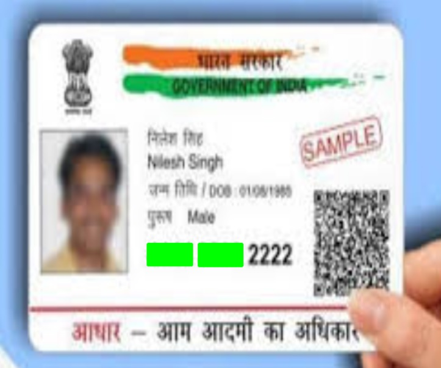

# Aadhar Number Mask generator

*************************************************************************************
Problem:
*************************************************************************************

	Mask the first two groups out of three group of 4 digits each of the Aadhar number

*************************************************************************************
Solution:
*************************************************************************************
	Steps:
		-> Read the input image
		-> if required rotate the image
		-> resize the image to 640x640
		-> convert into gray scale(mono crome)
		-> threshold it using cv2.THRESH_BINARY (range : 90 - 150)
		-> pass it to tesseract.image_to_data()
		-> text(output of tesseract)
		-> Search for Aadhar number in the detected text using regex search pattern methods
		-> Masked the image using the location of the detected text which matched with the pattern

*****************************************************
Dependent packages
*****************************************************
	-python 
	-opencv
	-pytesseract
	-PIL
	-argparse
	-regex

*****************************************************
Structure and Usage
*****************************************************
Directories:
	src-
		 contains code files		
	images-
		 contains testing images
	results-
		 contains masked images of Aadhar 
		
Usage:
	
python file.py --image [image path] [--smallcard |--bigcard |--photocopy] 
				
			[--rotate90|--rotate180|--rotate270](optional) 

Masked image will be displayed

*****************************************************
