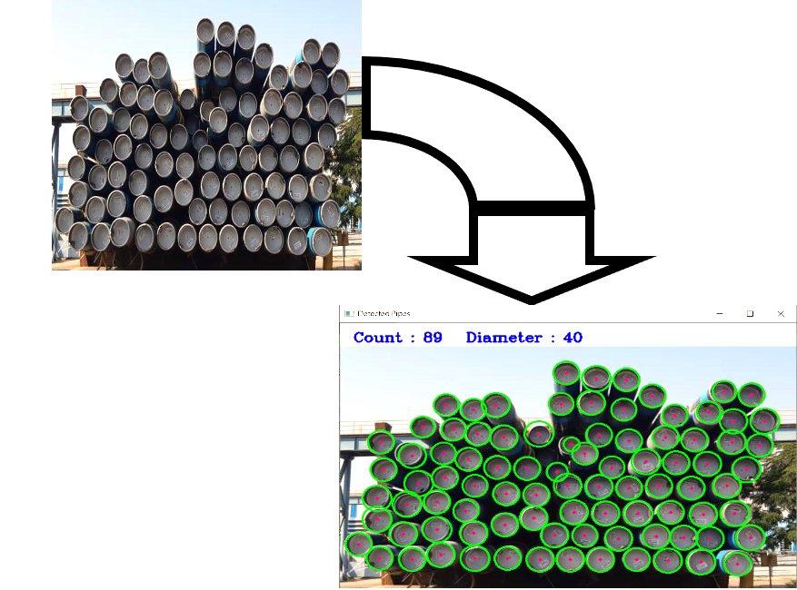

# Pipe counting using opencv 

Automatic counting of pipes using Computer Vision

Steps:
 -  Read the input image
 -  convert into gray scale and smooth using bilateralFilter (3x3)
 -  find the circular objects in image using cv2.HoughCircles by setting the correct parameters
 -  For each pipe, draw a circle at its outline and a circular dot at the centre
 -  Count the number of circles drawn to display it on screen

*****************************************************
Dependent packages:

- python 
- opencv
- numpy

*****************************************************
Structure :

- pipe_1.jpeg
- pipe_2.jpg
- pipe_1_result.png
- process.png
- pipe_detection.py

*****************************************************
Results:

Displays the numbers of pipes in a given image
*****************************************************

