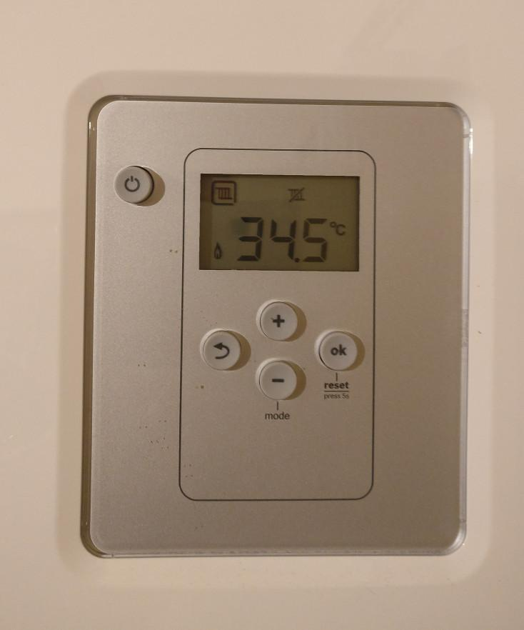

# Digit recognition of seven segment display

*************************************************************************************
Problem:

Automatic recognition of digits in a thermostat display

*************************************************************************************
Solution:
	Steps:
		-> Read the input image
		-> convert into gray scale and smooth using GaussianBlur (7x7)
		-> threshold it using cv2.THRESH_BINARY_INV (thresh_val = 50)
		-> extract digits from image by finding contours on the thresholded image
		-> define a SVM model and train it on unit sample of each digit from 0-9
		-> Using model make predictions on extracted digits from thermostat image
    		-> Test the model further on digits extracted from other images

*****************************************************
Dependent packages:
	-python 
	-opencv
	-PIL
	-numpy
	-matplotlib

*****************************************************
Structure :

-images:
  contains thermostat, training and testing images
-model.xml
-Digit recognition of 7 segment display.ipynb

*****************************************************
Results:

Digits in the display are predicted 
*****************************************************
